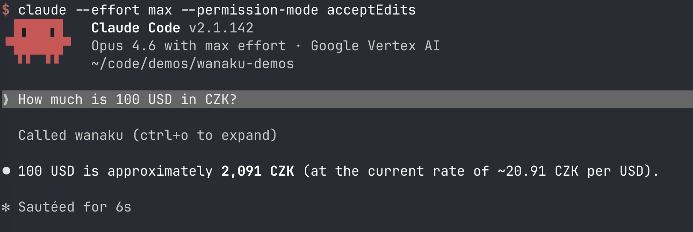

# Getting Started with Wanaku

Welcome to Wanaku! In this guide you will install the Wanaku CLI, start a local instance, add a tool, and
use it from an AI agent. By the end you will have a working MCP router that connects your agent to live
data — no containers, no complex setup.

## What You Will Need

1. Java 21 or later
2. An agent that supports the Model Context Protocol (MCP). 

## Step 1: Install the Wanaku CLI

Download the CLI from the [releases page](https://github.com/wanaku-ai/wanaku/releases/tag/v0.1.1).

The CLI ships in two flavors:

* **Native binaries** for Linux (x86_64) and macOS (AArch64) — no Java required
* **Java-based archive** that runs on any OS with Java 21+

For example, on macOS:

```shell
wget https://github.com/wanaku-ai/wanaku/releases/download/v0.1.1/wanaku-cli-0.1.1-osx-aarch_64.zip
unzip wanaku-cli-0.1.1-osx-aarch_64.zip
install -m 750 wanaku-cli-0.1.1-osx-aarch_64/bin/wanaku-cli $HOME/bin/wanaku-cli
rm -rf wanaku-cli-0.1.1-osx-aarch_64 wanaku-cli-0.1.1-osx-aarch_64.zip
```

> [!NOTE]
> Adjust the file name for your OS. On Linux, use the `linux-x86_64` variant. If you prefer the
> Java-based archive, download `wanaku-cli-0.1.1.zip` instead.

Verify the installation:

```shell
wanaku --version
```

## Step 2: Start Wanaku Locally

This single command downloads the router and the built-in capability services, then starts everything
on your machine:

```shell
wanaku start local
```

Authentication is disabled automatically in local mode, so there is nothing else to configure.

After a few seconds, open <http://localhost:8080> in your browser. You should see the Wanaku UI.

> [!TIP]
> You can enable additional capability services with the `--services` option. Run
> `wanaku start local --help` to see what is available.

## Step 3: Check That Everything Is Running

Use the CLI to verify that the capability services registered with the router:

```shell
wanaku capabilities list
```

You should see output similar to:

```
service serviceType  host      port status lastSeen
http    tool-invoker 127.0.0.1 9000 active Wed, May 28, 2026 at 10:00:00
```

This means Wanaku is up and running, and the HTTP capability service is ready to handle tool calls.

## Step 4: Add a Tool

Wanaku uses *toolsets* to group related tools together. Let's import a currency conversion toolset so your
agent can look up exchange rates.

### Option A: Via the Web UI

1. Open <http://localhost:8080/admin/#/service-catalog>
2. Click **Toolsets Repositories Tab**
3. Expand the **wanaku-toolsets** one.
4. Import the **currency** one.

### Option B: Via the CLI 

Use this if you prefer to do everything via CLI.

```shell
wanaku tools import https://raw.githubusercontent.com/wanaku-ai/wanaku-toolsets/refs/heads/main/toolsets/currency.json
```

Confirm the tool was added:

```shell
wanaku tools list
```

Expected output:

```
name                          namespace type uri                                                                                                       labels 
free-currency-conversion-tool default   http https://economia.awesomeapi.com.br/last/{parameter.value('fromCurrency')}-{parameter.value('toCurrency')} {}     
```

## Step 5: Connect an AI Agent

Wanaku speaks the [Model Context Protocol](https://modelcontextprotocol.io) (MCP) over HTTP. Any MCP-compatible
client can connect to it. How you do that will depend on the AI agent you are using. 

1. [Claude Desktop](https://claude.com/download): you can run Wanaku's command `wanaku configure claude`
2. [Cursor](https://cursor.com/): you can run Wanaku's command `wanaku configure cursor`
3. [Claude Code](https://claude.com/product/claude-code): `claude mcp add wanaku --transport sse http://localhost:8080/mcp/sse`
4. [IBM Bob](https://bob.ibm.com/): details [here](https://bob.ibm.com/docs/shell/configuration/mcp/mcp-bobshell).
5. For any other client, `http://localhost:8080/mcp/sse` for SSE or `http://localhost:8080/mcp/` for Streamable HTTP.

## Step 6: Testing

Then ask it a question like:

> How much is 100 USD in CZK?



## What's Next?

You now have a working Wanaku instance with a real tool. From here you can:

* Browse the [wanaku-toolsets](https://github.com/wanaku-ai/wanaku-toolsets) repository for more tools
* Try the [Camel JBang demo](../02-running-camel-jbang/README.md) to connect custom integrations
* Build your own capability service with the [Java Capabilities SDK](../04-plain-java-services/README.md)

If something does not work, check the logs printed by `wanaku start local` in your terminal.

If you find a bug, please [report it](https://github.com/wanaku-ai/wanaku/issues).
To get in touch with the community, visit the [Wanaku project](https://github.com/wanaku-ai/wanaku).
