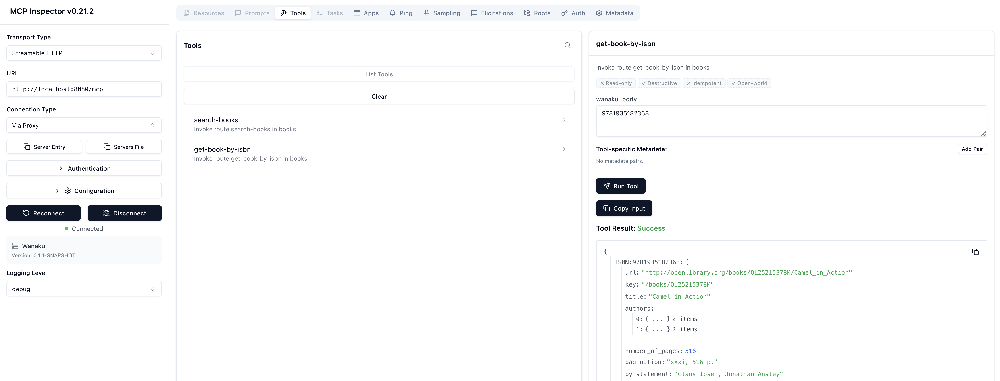
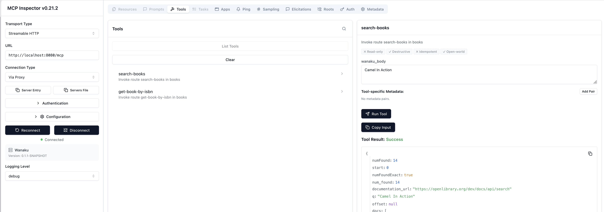

# Service Catalogs Demo

This demo walks you through creating and deploying a Service Catalog — a way to package Apache Camel routes as tools that AI agents can use through Wanaku.

## What You Will Learn

- How to create a Service Catalog with Apache Camel routes
- How to expose Camel routes as MCP tools
- How to deploy a Service Catalog to the Wanaku router

## What You Will Need

- **Wanaku CLI** installed (download from [releases page](https://github.com/wanaku-ai/wanaku/releases/tag/v0.1.1))
- **Wanaku running** via `wanaku start local` (see [Getting Started](../1.01-your-first-tool/README.md))

## Architecture Overview

```text
┌─────────────────┐
│   AI Agent      │
│  (Claude, etc)  │
└────────┬────────┘
         │ MCP Protocol
         ▼
┌─────────────────┐
│ Wanaku Router   │
│  (MCP Server)   │
└────────┬────────┘
         │
         ▼
┌─────────────────┐
│ Service Catalog │
│ (Camel Routes)  │
└────────┬────────┘
         │
         ▼
┌─────────────────┐
│ External System │
│ (API, Kafka,    │
│  Database, etc) │
└─────────────────┘
```

## Step 1: Initialize a Service Catalog

Create a new Service Catalog:

```shell
cd /tmp
wanaku service init --name=demo-catalog --services=books
```

This creates:

```text
demo-catalog/
├── index.properties
└── books/
    ├── books.camel.yaml
    ├── books.wanaku-rules.yaml
    └── books.dependencies.txt
```

## Step 2: Define a Camel Route

Edit `books/books.camel.yaml` and replace the contents with:

```yaml
- route:
    id: get-book-by-isbn
    description: Retrieve book information by ISBN
    from:
      uri: direct:get-by-isbn
      steps:
        - setHeader:
            name: CamelHttpMethod
            constant: GET
        - log:
            message: "Fetching book with ISBN: ${body}"
        - toD:
            uri: "https://openlibrary.org/api/books?bibkeys=ISBN:${body}&format=json&jscmd=data"
        - convertBodyTo:
            type: String
        - log:
            message: "Book data received: ${body}"

- route:
    id: search-books
    description: Search for books by title
    from:
      uri: direct:search-books
      steps:
        - setHeader:
            name: CamelHttpMethod
            constant: GET
        - log:
            message: "Searching for books with query: ${body}"
        - toD:
            uri: "https://openlibrary.org/search.json?q=${body}&limit=5"
        - convertBodyTo:
            type: String
        - log:
            message: "Search results received: ${body}"
```

> **Note:** These routes use the Open Library API, which is free and doesn't require authentication.

> [!TIP] You can use a visual editor suck as [Kaoto](https://kaoto.io) or 
> [Camel Karavan](https://camel.apache.org/karavan) to design and edit Camel routes.

## Step 3: Add Dependencies

Edit `books/books.dependencies.txt` and add:

```text
org.apache.camel:camel-http:4.18.2
org.apache.camel:camel-jackson:4.18.2
```

## Step 4: Expose Routes as Tools

Generate the Wanaku rules from the route IDs:

```shell
wanaku service expose --path=demo-catalog
```

This scans the Camel routes and generates `books/books.wanaku-rules.yaml`. Edit that file so it
includes the `wanaku_body` property for each tool:

```yaml
# Auto-generated Wanaku rules for books
# Generated by 'wanaku service expose'
mcp:
  tools:
    - get-book-by-isbn:
        route:
          id: "get-book-by-isbn"
        description: "Invoke route get-book-by-isbn in books"
        properties:
          - name: wanaku_body
            type: string
            description: The greeting message to send
            required: true
    - search-books:
        route:
          id: "search-books"
        description: "Invoke route search-books in books"
        properties:
          - name: wanaku_body
            type: string
            description: The greeting message to send
            required: true
```

> [!NOTE]
> This manual edit is only needed in version 0.1.1 due to a
> [known issue](https://github.com/wanaku-ai/wanaku/issues/1234). Future versions will generate
> the `wanaku_body` property automatically.

## Step 5: Deploy the Service Catalog

Deploy the catalog to the Wanaku router:

```shell
wanaku service deploy --path=demo-catalog --host=http://localhost:8080
```

## Step 6: Download and Run the Camel Integration Capability

The Service Catalog contains Camel routes, but something needs to actually *run* them. That is the
[Camel Integration Capability](https://github.com/wanaku-ai/camel-integration-capability) — a standalone
service that executes the routes and registers itself with the Wanaku router.

Download the jar from the [releases page](https://github.com/wanaku-ai/camel-integration-capability/releases/tag/v0.1.1):

```shell
wget https://github.com/wanaku-ai/camel-integration-capability/releases/download/v0.1.1/camel-integration-capability-main-0.1.1-jar-with-dependencies.jar
```

### Option A: Use the Wanaku UI

Open the Service Catalog page at <http://localhost:8080/admin/#/service-catalog>, find `demo-catalog`, and
click **Deploy**.

### Option B: Get instructions from the CLI

```shell
wanaku service instructions --name demo-catalog --model=local
```

This prints the exact command you need. For a local setup it looks like:

```shell
java -jar camel-integration-capability-main-0.1.1-jar-with-dependencies.jar \
  --registration-url http://localhost:8080 \
  --registration-announce-address localhost \
  --grpc-port 9190 \
  --name books \
  --client-id wanaku-service \
  --service-catalog demo-catalog \
  --service-catalog-system books \
  --fail-fast
```

> [!NOTE]
> Authentication flags (`--client-secret`) is not needed when running with
> `wanaku start local`, since auth is disabled.

Run that command in a separate terminal. After a few seconds the capability service registers
with the router and the tools become available.

## Step 7: Verify

Open the Wanaku Admin UI at <http://localhost:8080/#/service-catalog>. You should see `demo-catalog` listed with 2 services.

Verify via CLI:

```shell
wanaku tools list
```

You should see:

```
name             namespace type  uri                      labels
get-book-by-isbn default   books books://get-book-by-isbn {}
search-books     default   books books://search-books     {}
```

## Testing the Tools

You can use the MCP Inspector to test the tools interactively:

```shell
npx @modelcontextprotocol/inspector
```

Try invoking `get-book-by-isbn` with:

```json
{
  "wanaku_body": "9781935182368"
}
```

The tool should return details for *Camel in Action* from the Open Library API.



You can also try `search-books`:

```json
{
  "wanaku_body": "Camel In Action"
}
```



## What's Next?

- Learn how to use and create [Service Templates](../2.03-service-templates/README.md) for reusable integration blueprints
- Read the [Service Catalogs Guide](https://github.com/wanaku-ai/wanaku/blob/main/docs/service-catalogs.md)

## Troubleshooting

### Service Catalog deployment fails

- Verify the `index.properties` file is correctly formatted
- Check that all file paths in `index.properties` match actual files
- Ensure the Wanaku router is running and accessible

### Tools not appearing after deployment

- Refresh the Admin UI (hard refresh: Ctrl+Shift+R)
- Check the Wanaku router logs in the terminal running `wanaku start local`

### Camel route fails with "component not found"

- Verify the dependencies are correctly listed in `dependencies.txt`
- Check that the Maven coordinates are valid and the version exists

If you find a bug, please [report it](https://github.com/wanaku-ai/wanaku/issues).
